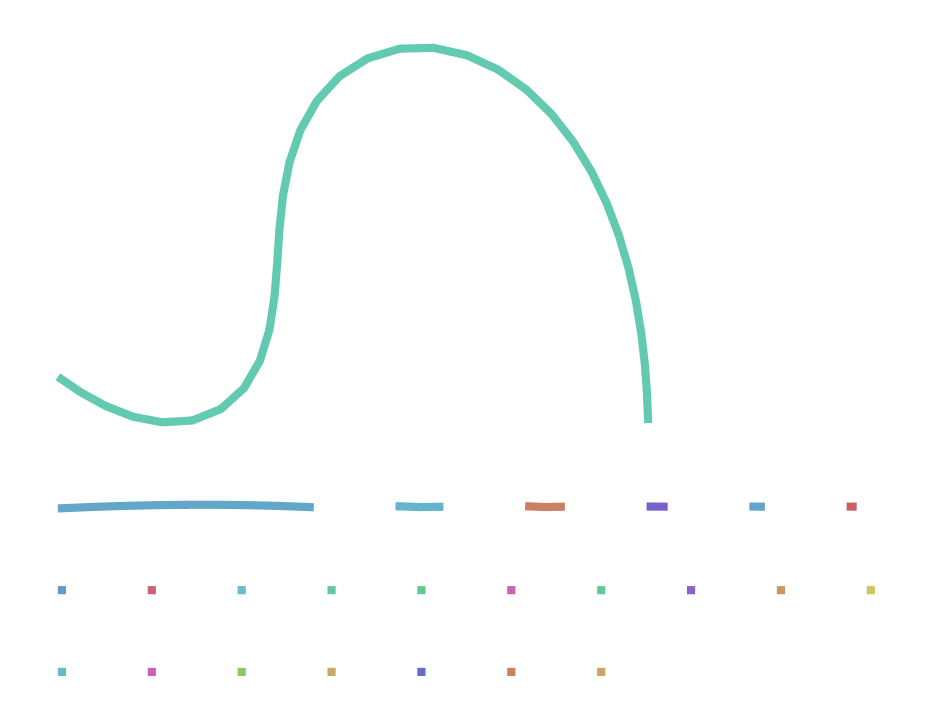

## Objetivo

Ensamblar el genoma de un eucariota diploide con lecturas de PacBio de alta fidelidad.

##Preparación

#Hifiasm

El programa hifiasm no está instalado en los ordenadores virtuales, y por tanto es necesario hacerlo manualmente, siguiendo los pasos siguientes en el terminal de Bash. Lo recomendable es instalarlo en una carpeta bin dentro de la carpeta de usuaria.

## Instalación de hifiasm

```{bash}
#| label: instalacion-hifiasm
#| eval: false

# Crear carpeta bin si no existe y entrar en ella
if [ ! -d ~/bin ]; then mkdir ~/bin; fi
cd ~/bin

# Descargar el código fuente y compilarlo
git clone [https://github.com/chhylp123/hifiasm](https://github.com/chhylp123/hifiasm)
cd hifiasm
make

# Añadir el programa al PATH permanentemente para que el ordenador lo encuentre
echo 'export PATH=$PATH:~/bin/hifiasm' >> ~/.bashrc
. ~/.bashrc
```

```{bash}
#| label: instalacion-compleasm
#| eval: false

cd ~/bin
# Descargar el paquete comprimido
wget [https://github.com/huangnengCSU/compleasm/releases/download/v0.2.7/compleasm-0.2.7_x64-linux.tar.bz2](https://github.com/huangnengCSU/compleasm/releases/download/v0.2.7/compleasm-0.2.7_x64-linux.tar.bz2)

# Descomprimir y renombrar la carpeta
tar -jxvf compleasm-0.2.7_x64-linux.tar.bz2
mv compleasm-0.2.7_x64-linux compleasm_kit
```

## Datos

Vamos a usar lecturas HiFi generadas por Rabanal et al. (2022) de un único individuo de la planta Arabidopsis thaliana, ecotipo Columbia (Col-0), con la tecnología SMRT de PacBio (proyecto PRJEB50694). Los datos seleccionados son solo una parte de los originales y se encuentran en el archivo At4.10.fa.gz (46 Mb), disponible en el aula virtual. También está en el espacio de disco compartido de la Universidad de Valencia, dentro del grupo de bioinformática. Este espacio es directamente accesible desde los ordenadores virtuales.

En adelante supondré que el archivo está guardado en la carpeta data y que su path relativo es ../../data/At4.10.fa.gz.

## Revisión de los datos

Los datos están en formato FASTA porque contienen sólo lecturas de alta calidad, y hifiasm no utiliza la información de las calidades de cada base. El archivo está comprimido. Antes de empezar el ensamblaje deberíamos tener una idea de la cantidad de datos que tenemos. Si lo necesitas, utiliza una inteligencia artificial para responder las preguntas siguientes y anota en un bloque de código las órdenes utilizadas. Puedes hacerlo con instrucciones de Bash o de R, pero R necesitará cargar en memoria el archivo entero, lo que no sería muy práctico si se tratara de un archivo 10 o 50 veces mayor.

:::{.callout-note icon=false}
# Ejercicio 1. Estadísticas de lectura

```{bash}
# Calculamos el número de lecturas, la longitud mínima, máxima y media, así como el total de bases.
zcat ../../data/At4.10.fa.gz | awk 'BEGIN{min=1e9; max=0; total=0; n=0} /^>/{if(seqlen>0){n++; total+=seqlen; if(seqlen<min)min=seqlen; if(seqlen<max)max=seqlen}; seqlen=0; next} {seqlen+=length($0)} END{if(seqlen>0){n++; total+=seqlen; if(seqlen<min)min=seqlen; if(seqlen<max)max=seqlen}; print "Lecturas totales: " n "\nLongitud Mínima: " min "\nLongitud Máxima: " max "\nLongitud Media: " total/n "\nBases totales: " total}'
```

# Cálculo de la cobertura:
Si el genoma de Arabidopsis mide aproximadamente 135 Mb (aunque el cromosoma 4 son unos 19 Mb), y las bases totales obtenidas arriba son (ejemplo) 760,000,000 bp, dividimos:
Cobertura=Bases totales/Tamaño del genoma=760.000.000/19.000.000=40X.
:::

## Ensamblaje

El programa hifiasm produce varios archivos de salida. Para tener la carpeta de trabajo ordenada, es recomendable crear un subcarpeta donde poder guardarlos. Si fuéramos a probar más de una estrategia de ensamblado, guardaríamos los resultados de cada intento en una carpeta diferente, que podríamos nombrar asm1, asm2, etc. Aunque sólo realicemos un ensamblaje, crearemos la carpeta asm1 para guardar los resultados en ella.

# Con la ejecución condicional nos ahorramos algún mensaje de error:
```{bash}
if [ ! -d asm1 ]; then mkdir asm1; fi
```

El ensamblaje de estas lecturas puede durar unos minutos. No queremos tener que ejecutarlo cada vez que compilamos el documento de Quarto. Tenemos dos opciones: o bien usamos la directriz #| cache: true al principio del bloque de código o bien controlamos directamente la ejecución condicional con Bash. Si usamos el método que ofrece Quarto, aparecerá una nueva carpeta que guarda resultados previos y que estaría bien incluir en el repositorio de Git. Yo prefiero usar Bash:

```{bash}
export PATH="$PATH:$HOME/bin/hifiasm"
if [ ! -e asm1/At4.bp.p_ctg.gfa ]; then
   hifiasm -o asm1/At4 -t 2 -f 0 ../../data/At4.10.fa.gz 2> asm1/hifiasm.log
fi
```

Las opciones significan lo siguiente:

    -o asm1/At4: usa el prefijo asm1/At4 para los archivos de salida.
    -t 2: usa dos procesadores. Por defecto usaría uno.
    -f 0: inhabilita el uso de un filtro de Bloom (Melsted and Pritchard 2011) durante la corrección de errores, que ocuparía 16 Gb de memoria.
    ../../data/At4.10.fa.gz: archivo con los datos de partida.
    2> asm1/hifiasm.log: guarda los numerosos mensajes que hifiasm envía al error estándar en un archivo asm1/hifiasm.log. Esto evita que esos mensajes se acumulen en el informe HTML.

:::{.callout-note icon=false}
# Ejercicio 2
Haploide vs Diploide: Los resultados corresponden a un genoma diploide. Hifiasm separa por defecto los dos alelos (haplotipos).

Purga de duplicaciones: Se ha aplicado el nivel de purga por defecto (Nivel 3), que elimina duplicaciones causadas por la heterocigosidad.

Lecturas ultra-largas: Si tuviéramos datos de Oxford Nanopore (UL), usaríamos el parámetro --ul.

:::
## Evaluación del resultado
:::{.callout-note icon=false}
# Ejercicio 3
Secuencias: Se guardan en formato GFA (Graphical Fragment Assembly). El archivo principal es At4.bp.p_ctg.gfa.

Líneas 'A': Indican alineamientos o conexiones de lecturas que justifican la unión de dos fragmentos.

Archivos .bed: Contienen regiones de las lecturas que han sido filtradas o marcadas como repetitivas.

Cobertura: Hifiasm estima la cobertura de regiones homocigotas y heterocigotas comparando la abundancia de k-meros (esto se ve en el archivo hifiasm.log).
:::

Los ensamblajes primario y por haplotipos se presentan en formato GFA. Para extraer las secuencias en formato FASTA podemos usar el pequeño script siguiente, en lenguaje AWK, desde el terminal de Bash:

```{bash}
awk '(/^S/){print ">" $2 "\n" $3}' asm1/At4.bp.p_ctg.gfa > asm1/At4.fa
```

## Calidad del ensamblaje

Para obtener las estadísticas del ensamblaje utilizaremos el programa compleasm (Huang and Li 2023), que no está instalado en el ordenador virtual. Está programado en Python y depende del módulo pandas de Python. En WSL, este módulo o paquete probablemente pueda instalarse con apt install python3-pandas. Alternativamente, en los sistemas con conda podéis hacer conda install pandas. En el ordenador virtual, el módulo pandas ya está disponible.

```{bash}
if [ ! -e asm1_eval/summary.txt ]; then
   python3 ~/bin/compleasm_kit/compleasm.py run \
      -t 2 -l brassicales -a asm1/At4.fa -o asm1_eval
fi
```

En adelante supondré que compleasm.py está en ~/bin/compleasm_kit. El programa necesita descargar la lista de genes típica del linaje al que pertenece el ensamblaje. En nuestro caso, el linaje es el de las Brassicales. La orden siguiente puede tomar más de 10 minutos.

```{bash}
if [ ! -e asm1_eval/summary.txt ]; then
   python3 ~/bin/compleasm_kit/compleasm.py run \
      -t 2 -l brassicales -a asm1/At4.fa -o asm1_eval
fi
```

:::{.callout-note icon=false}
# Ejercicio 4
-t 2: Número de núcleos del procesador (threads).

-l brassicales: Base de datos de genes específicos para plantas del orden Brassicales (Arabidopsis).

-a: Archivo de entrada (nuestro ensamblaje At4.fa).

-o: Carpeta de salida para los resultados.
:::

## Visualización del grafo

Desafortunadamente, no existe todavía ningún paquete de R para visualizar ensamblajes como grafos de fragmentos a partir de archivos .gfa. Uno de los visualizadores más populares es bandage, una aplicación gráfica que puede instalarse fácilmente en cualquier sistema operativo, pero que no ofrece interfaz por línea de comandos.

:::{.callout-note icon=false}
# Ejercicio 5
He visualizado el grafo del ensamblaje utilizando el programa Bandage. La red de conexiones representa los contigs ensamblados por hifiasm:


:::

# References
Huang, Neng, and Heng Li. 2023. “Compleasm: A Faster and More Accurate Reimplementation of BUSCO.” Bioinformatics 39 (10): btad595. https://doi.org/10.1093/bioinformatics/btad595.
Melsted, P., and J. K. Pritchard. 2011. “Efficient Counting of k-Mers in DNA Sequences Using a Bloom Filter.” BMC Bioinformatics 12: 333. https://doi.org/10.1186/1471-2105-12-333.
Rabanal, Fernando A, Maike Gräff, Christa Lanz, Katrin Fritschi, Victor Llaca, Michelle Lang, Pablo Carbonell-Bejerano, Ian Henderson, and Detlef Weigel. 2022. “Pushing the Limits of HiFi Assemblies Reveals Centromere Diversity Between Two Arabidopsis Thaliana Genomes.” Nucleic Acids Research 50 (21): 12309–27. https://doi.org/10.1093/nar/gkac1115.
